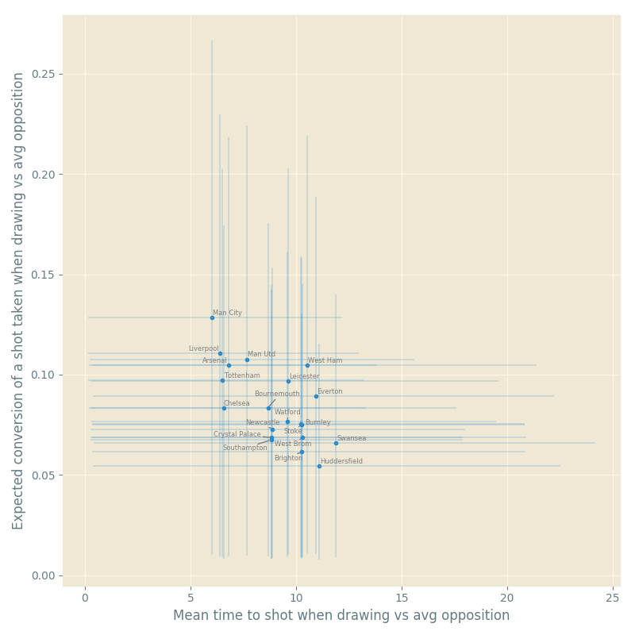
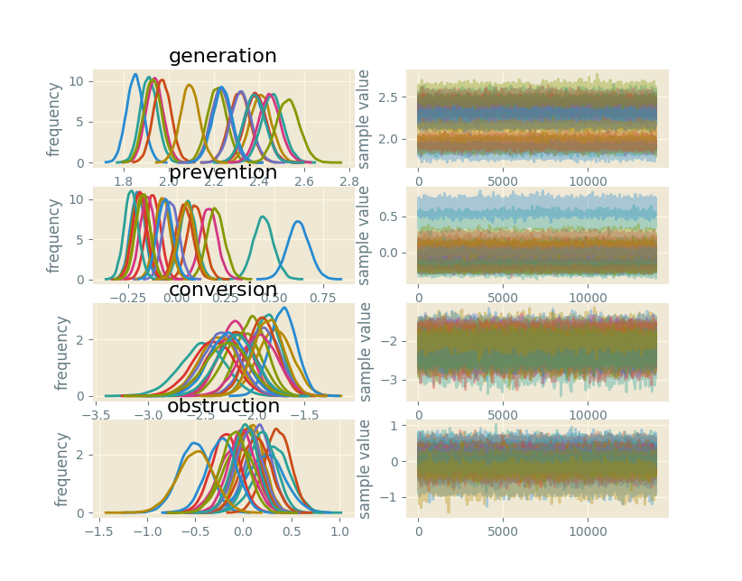

# shot-generation
Rigorous Bayesian modelling of shooting in soccer.

### Model
There is a dedicated wiki page with 
[Model definition](https://github.com/huffyhenry/shot-generation/wiki).

### Execution
Currently the model is best executed and visualised via IPython, like so:

```python
%run run.py
samples, team_map = run()
graph(samples, team_map)
```
which produces a scatter plot of team coefficients with 50% CIs:


Note that while the CIs are very wide, this is due
to the fact that that the mean time to shot is the inverse of the shooting rate
and thus the effect of extremely small values is magnified. The underlying team 
coefficients are in fact significantly different from one another, as illustrated
by further running

```python
samples.plot()
plt.show()
```
which yields


### Status
The model is unfit for (any) purpose until a number of improvements are made as per
the [Issues](https://github.com/huffyhenry/shot-generation/issues?q=is%3Aissue+is%3Aopen+label%3Amodel-design). 
